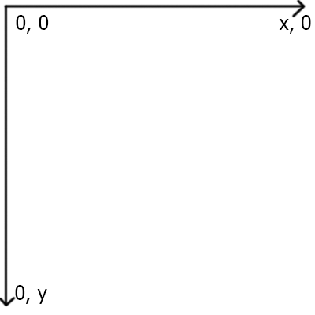
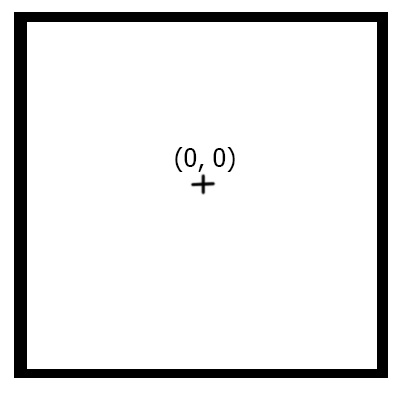
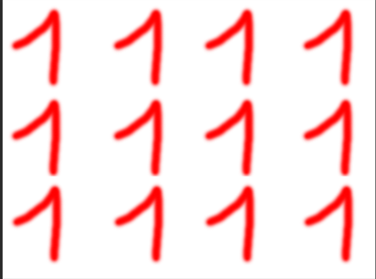

# JamEngine
2dEngine created for personal use in Game Jam. It is written in C++ 17 and use OpenGL API. (Work in Progress)

It works on Linux and Windows.

Tested on : Debian 8, Mint 18 and Windows 10

## Dependencies
* SDL2
* SDL2_image
* SDL2_mixer
* glm 
* CMake, at least 3.0
* OpenGL

## Compiling
It use C++ 17 so you need a compatible compiler, g++-7 or MSVC 17 is fine.

## How it works 
All the code is wrap into the namespace JamEngine.
Warning : the folder shader must be copy in the same folder than your executable

To compile your program that use JamEngine you need to link to several lib :

On Windows :` 2Dengine SDL2 SDL2_mixer glish utils opengl32 glu32 glew32s  glew32`

On Linux : `2Dengine SDL2 SDL2_mixer glish utils GL GLEW GLU`
#### Frame



#### Position
The position of all object are define from the center of the object.


#### Scene
This class is a Singleton. You'll have very few interactions with this. You have only 4 methods that you will use :
* *add* : add an Entity
* *remove* : remove Entity without destroying it
* *delete* : remove and destroy Entity
* *clear* : remove all Entities

#### GameState 
Hold the GameLoop of your game. 
* *loop* : Call this to begin the game loop
* *gameOver* : call this anywhere in your code and it will end the loop


By default, the escape button and the cross on the Window trigger the end of the loop.
#### Window
Create your program window, it only take one thing in parameter `windowSettings` which handle all the parameter you need too create a simple window

#### Entity
Base class of all object in your game. You have to inherited from this class and you can override some function like :
* *update* : things to do every frame
* *collide* : define collision type and what to do when collision occur
* *display* : define how it will be display

Don't forget to call the based function.

To add your Entity to the Scene you need to use the `add` function of `Scene` :
```cpp
Entity a;
Scene::add(&a);
```

#### Layer
Layers are useful to define if your object has to be display in front of an other object. There is a default layer define with the "default" key. It will always be the background. To define layers, you must fill a config file like this :

```ini
backgroud
firstlayer
secondLayer
foreground
```

Now you have to tell the scene that you want to use that config file.

```cpp
Scene::init("configFile");
```

To tell that your Entity have to use that layer, you have to use the function
`setLayer` in a derived class.

```cpp
struct Foo : Entity{
    Foo(){
        setLayer("firstLayer");
    }
}
```
Notice that as soon as you have added your Entity to your scene, the layer is locked.
#### Sprite
You can also use SpriteSheet to add animation to your Entity, it can also be just one image.

As always you will have a config file. It look like this
```ini
path/to/folder/
test test.png 1 1
```

First line, like for the sound manager, it is the path for the root directory of your sprite sheets.
When you declare a sprite sheet, you need to write 4 things :
* the key to access your sprite sheet within the code
* the relative path of your file
* the number of image horizontally
* the number of image vertically

Example :



```ini
test/
example example.png 4 3
```

Now you have to tell to the SpriteSheetManager where is your config file, just do this
```cpp
SpriteSheetManager::init("yourfile");
```

And now you can add your spriteSheet to an Entity
```cpp
Entity ent;
ent.setSpriteSheet("key", 5);
// key is the key of your spriteSheet
// 5 is the number of second before the engine change the image, put 0 to disable the change
// You can do that directly in your Entity
```
#### Collider

JamEngine provide 2 types of colliders, SquareCollider and SphereCollider. You can add several Colliders to one Entity.
To do that, you just have to use one of the two functions member of Entity  :
```cpp
addSphereCollider(glm::vec2 pos, float radius, Function)
addSquareCollider(glm::vec2 pos, glm::vec2 size, Function)
```
`pos` is define relatively to the Entity that your collider will be attach.
The third parameter is the function that determine what to do when a collision occur.
#### KeyEvent
To use the InputEventHandler you need to prepare two things. First you need to write a config file to link a word to one or two keys. It look like this 
```ini
jump = space
move = w, z
```
Here `jump` is associated with the `space bar`, and `move` with the `w` and `z` keys. After that you need to tell to the InputEventHandler which file to use with the init function.
```
GET_INPUTEVENTHANDLER("default").init("youFile");
```
Now the initialisation is correctly done. Two function are available to define if you want the action to be done when the key is pressed or released. 
```cpp
GET_INPUTEVENTHANDLER("default").addInputEventPressed("move", []{//something});
GET_INPUTEVENTHANDLER("default").addInputEventReleased("jump", []{//something else});
```
#### Event
You can add some event, anywhere, at anytime in your code. You define the duration of your event and what it does.
To do that, you only have to use the `addEvent` function of the Event Manager, it take two parameter. First it's the duration in second and the other is the function to execute each frame. The function must take one float parameter. It's the time since the first execution of this function. So you can add event like this
```cpp
EventManager::addEvent(5, [](float time){
    std::cout << "time since first execution " << time << " seconds" << std::endl;
};);
```
It will display this at every frame for 5 seconds.
Here I use a Lambda function, but you can use what you want.

#### Sound
It also possible to add sound in you game, but like the InputEventHandler, it need a config file.
```ini
path/to/your/sound/folder
test sound.wav
other afolder/anOtherSound.wav
```
The first line define a root location for your sound file. In this example, my root path is `path/to/your/sound/folder`.
So the first file is here `path/to/your/sound/folder/sound.wav`, while the second is here `path/to/your/sound/folder/afolder/anOtherSound.wav`. The first word of each line is the key to reach the sound in the code and play it. (example a few line later)

You also need to initialize the SoundManager, you can do that, this way :
```cpp
Sound::init("yourFile");
```

Now you can play sound. To do this, it's simple just call the `play` or `playInfinite` function, with the key of your sound in parameter.

Example :
```cpp
SoundManager::play("test"); // play test once with default volume
SoundManager::play("test", 2); // play test twice with default volume
SoundManager::play("test", 2, 0.2); // play test twice with volume at 20% of maximum
// It will play the sound.wav file
```
